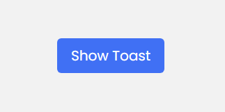
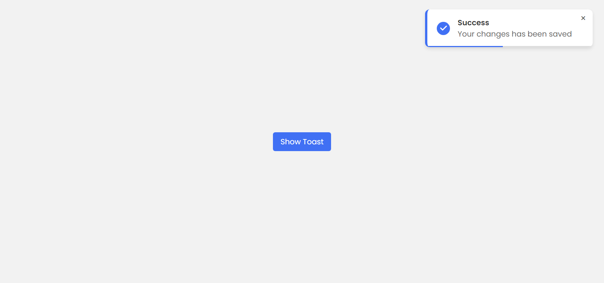

# Toast Notification

A very beautiful and light Toast Notification to display messages on the site. Instead of using heavy libraries, you can use this light and optimized piece of code to display different messages on your site.
<a href="https://cdnjs.cloudflare.com/ajax/libs/font-awesome/6.0.0/css/all.min.css">Font Awesome</a> is used for the icon

### Toast Notification:
* Show Toast Notification button

* Show Toast Notification

