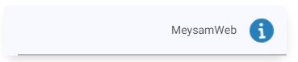

# Toast Notification

## Installation

1. **Requirements**: `jQuery` and `Font Awesome`.
2. **Download**: Clone or download the repository.
3. **Include**: Include the `<script src="toast.js"></script>` file in your Site.

## Demo
#### Success


#### Error


#### Danger


#### Info


## How to Use
#### Form Handling Example

```javascript
// show success
displayToastNotification('MeysamWeb', 'fa-check', '#27ae60', 'slide-in-fade-out');

// show error
displayToastNotification('MeysamWeb', 'fa-xmark', '#c0392b', 'slide-in-fade-out');

// show danger
displayToastNotification('MeysamWeb', 'fa-triangle-exclamation', '#f39c12', 'slide-in-fade-out');

// show info
displayToastNotification('MeysamWeb', 'fa-info', '#2980b9', 'slide-in-fade-out');

```

## Contributing

Contributions are welcome! If you have suggestions for improvements or have found a bug, please open an issue or submit a pull request. Make sure to follow the contributing guidelines.

## License
This project is licensed under the MIT License.

## Contact
For questions or support, please contact [MeysamWeb](https://github.com/meysamweb).